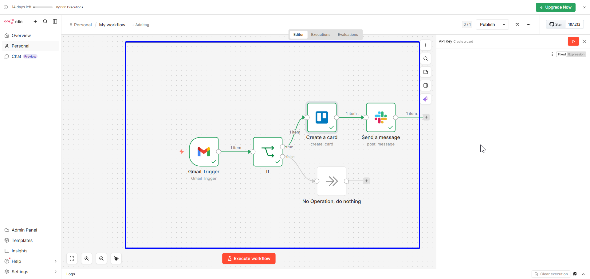

# n8n-email-triage-automation
Built an end-to-end email triage automation using n8n that monitors a Gmail inbox in real time, filters urgent emails using conditional logic, automatically creates a Trello task card with the email details, and sends an instant Slack notification to the team.
# 📬 Automated Email Triage Workflow — n8n

An intelligent email automation workflow that monitors a Gmail inbox for urgent messages, automatically creates a Trello task card, and sends an instant Slack notification — eliminating manual email monitoring entirely.

---

## 🔍 Problem It Solves

In fast-paced environments, urgent emails get buried. This workflow ensures that any email marked as urgent is:
- Instantly captured and turned into an actionable task
- Visible to the whole team via Slack
- Never missed or forgotten

---

## ⚙️ How It Works

```
Gmail Trigger → IF (subject contains "urgent") → Trello (create card) → Slack (send notification)
```

1. **Gmail Trigger** — monitors inbox continuously for new emails
2. **IF Node** — filters emails where the subject contains the keyword `urgent`
3. **Trello Node** — automatically creates a new card in the designated list with the email subject and body
4. **Slack Node** — posts an instant notification to a chosen channel with the email subject

---

## 🛠️ Tools & Integrations

| Tool | Purpose |
|------|---------|
| n8n | Workflow automation engine |
| Gmail API | Email trigger and monitoring |
| Trello API | Task card creation |
| Slack API | Team notification |

---

## 📸 Workflow Preview

> 

---

## 🚀 How to Use This Workflow

### Prerequisites
- n8n account (free at [n8n.io](https://n8n.io))
- Gmail account
- Trello account with at least one board
- Slack workspace with at least one channel

### Setup Steps

1. **Import the workflow**
   - Download `workflow.json` from this repo
   - In n8n, go to **Workflows** → **Import from file**
   - Select `workflow.json`

2. **Connect your credentials**
   - Click the Gmail node → add your Gmail OAuth2 credential
   - Click the Trello node → add your Trello API key (get it at [[trello.com/app-key](https://trello.com/app-key](https://trello.com/power-ups/admin))
   - Click the Slack node → authorize your Slack workspace

3. **Configure the workflow**
   - In the Trello node: select your Board and List
   - In the Slack node: select your notification channel
   - In the IF node: change the keyword `urgent` to whatever trigger word you prefer

4. **Activate**
   - Toggle the workflow **ON**
   - Send a test email with "urgent" in the subject
   - Watch the Trello card and Slack message appear automatically ✅

---

## 📁 Files

```
├── workflow.json        # n8n workflow export (import directly into n8n)
└── README.md            # This file
```

---

## 💡 Possible Extensions

- Add an email auto-reply confirming receipt
- Escalate to a different Slack channel based on sender
- Connect to Microsoft Teams instead of Slack
- Add a priority label based on keywords (urgent, ASAP, critical)
- Log all urgent emails to a Google Sheet for tracking

---

## 👤 Author

**Kodjo Hugues Ballo**
IT Support & Automation Specialist | Python | Active Directory | n8n

- 🔗 [Upwork Profile](https://www.upwork.com/freelancers/~014627f395c6a1484e)
- 💼 [LinkedIn](https://www.linkedin.com/in/kodjo-hugues-ballo-141327158/)
- 🐙 [GitHub](https://github.com/kodjoballo)

---

## 📄 License

MIT — free to use and adapt.
